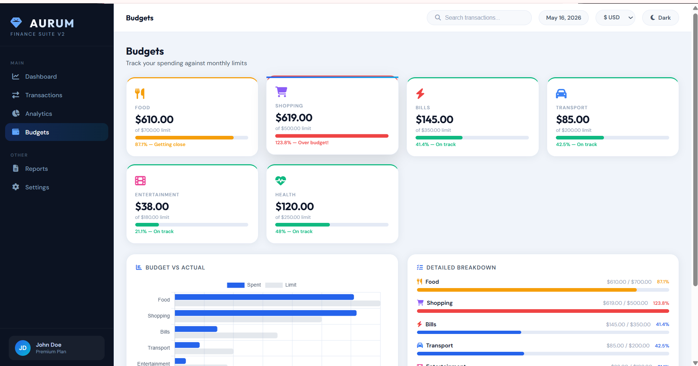
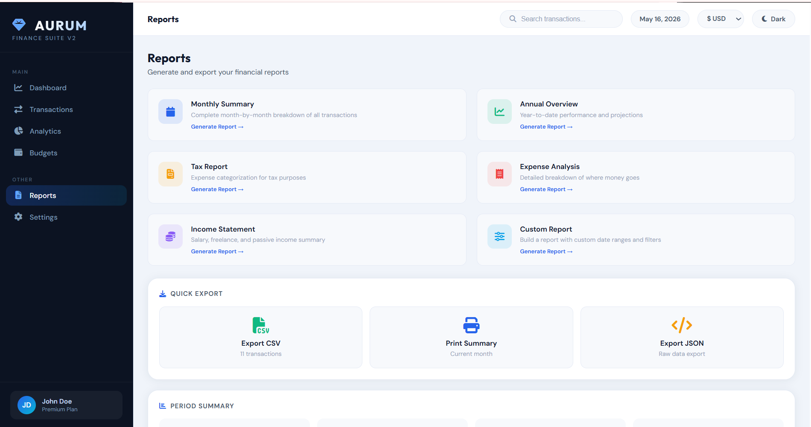

# 💰 AURUM Finance Dashboard


> **A premium, enterprise-grade personal finance dashboard** to track income, expenses, budgets, and financial insights in real-time.

## 🌐 Live Demo
🔗 [View Live Dashboard](https://sara12-2.github.io/Expense_Tracer_Dashboard/)

---

## 📸 Screenshots

| Dashboard (Light) | Dashboard (Dark) |
|:---:|:---:|
|  |  |

| Analytics | Budgets |
|:---:|:---:|
|  |  |

| Transactions | Reports | Settings |
|:---:|:---:|:---:|
|  |  |  |

---

## ✨ Features

### 📊 Dashboard
- **KPI Cards** - Balance, Income, Expenses, Savings Rate
- **Donut Chart** - Income vs Expenses visualization
- **Pie Chart** - Category-wise spending breakdown
- **Recent Transactions** - Latest 6 entries
- **Quick Add Form** - Instant transaction entry
- **Budget Overview** - Progress bars for all categories
- **Financial Insights** - Top category, savings rate, daily average

### 📝 Transactions
- ✅ Complete CRUD operations (Create, Read, Update, Delete)
- 🔍 Search/Filter by title or category
- 📊 Mini statistics (Total Income, Expenses, Balance)
- ✏️ Inline Edit/Delete buttons
- 🎨 Color coding (Green = Income, Red = Expense)

### 📈 Analytics
- 📊 Monthly cash flow bar chart
- 📉 Cumulative balance line chart
- 🔥 Spending heatmap by category
- 💹 Balance ratio and savings rate

### 💰 Budgets
- 6 pre-set categories (Food, Shopping, Bills, Transport, Entertainment, Health)
- 📊 Budget vs Actual horizontal bar chart
- 🎨 Color-coded alerts:
  - 🟢 Green: Under 70%
  - 🟡 Amber: 70-90%
  - 🔴 Red: Over 90%

### 📄 Reports
- 📥 CSV Export
- 🖨️ Print Summary
- 📦 JSON Export
- 📑 6 report templates

### ⚙️ Settings
- 🌓 Dark/Light mode toggle
- 💱 Multi-currency support (USD, EUR, GBP, INR, JPY)
- 🔔 Notification preferences
- 🔄 Data reset option

---

## 🛠️ Tech Stack

| Technology | Purpose |
|------------|---------|
| HTML5 | Structure |
| CSS3 | Styling & Animations |
| JavaScript (ES6) | Functionality |
| Chart.js v4.4.0 | Data visualization |
| Font Awesome 6.5.0 | Icons |
| Google Fonts | Typography (Outfit, DM Sans) |

---

## 💻 Installation

### Option 1: Direct Download
```bash
# 1. Download index.html
# 2. Double-click to open in browser
# 3. Start managing finances!
```

**Option 2: Clone Repository**
```bash
git clone https://github.com/Sara12-2/Expense_Tracer_Dashboard.git
cd Expense_Tracer_Dashboard
open index.html
```
**Option 3: Local Server**
```bash
# Python 3
python -m http.server 8000

# VS Code Live Server
# Right-click index.html → Open with Live Server
```
**Option 4: GitHub Pages**
```bash
# Already live at:
https://sara12-2.github.io/Expense_Tracer_Dashboard/
```

**🎨 Customization**
**Change Brand Colors**
```bash
css
/* In :root selector */
--accent: #2563eb;  /* Primary color */
--green: #10b981;   /* Success color */
--red: #ef4444;     /* Danger color */
```
**Add New Budget Category**
```bash
javascript
const BUDGETS = [
  { category: 'Food', limit: 700 },
  { category: 'New Category', limit: 500 }, // Add this
];

const CAT_ICONS['New Category'] = '<i class="fa-solid fa-tag"></i>';
const CAT_COLORS['New Category'] = '#8b5cf6';
```
**Add New Currency**
```bash
html
<option value="₿">₿ BTC</option>
```

**📁 Project Structure**
```bash
text
Expense_Tracer_Dashboard/
│
├── index.html                    # Main application
├── README.md                     # Documentation
│
├── AURUM Dashbaord .png          # Dashboard screenshot
├── AURUM Dashbaord 1.png         # Dashboard alt view
├── Analytics .png                # Analytics page
├── Budgets.png                   # Budgets page
├── Dark Mode.png                 # Dark mode view
├── Reports.png                   # Reports page
├── Settings .png                 # Settings page
└── Transactions .png             # Transactions page

```


### ⚡ Loading Times

| Connection Type | Load Time |
|----------------|-----------|
| Fiber / Broadband | <0.5s |
| 4G Mobile | ~1.0s |
| 3G Mobile | ~1.8s |
| Offline (Cached) | Instant |

---

## 📝 Changelog

### 🚀 Version 2.0 (March 2025)

#### ✨ New Features
| Feature | Description |
|---------|-------------|
| **CRUD Operations** | Complete Create, Read, Update, Delete for transactions |
| **Dark/Light Mode** | Seamless theme switching with localStorage persistence |
| **Multi-Currency** | Support for USD, EUR, GBP, INR, JPY |
| **Chart.js Integration** | Beautiful donut, pie, bar, and line charts |
| **Search/Filter** | Real-time transaction search by title or category |
| **Responsive Design** | Perfect on desktop, tablet, and mobile |
| **LocalStorage** | Automatic data persistence |
| **CSV/JSON Export** | Download your financial data |
| **Budget Tracking** | Visual progress bars with color-coded alerts |
| **Analytics Page** | Monthly trends and cumulative balance |
| **Print Summary** | Print-friendly financial overview |
| **Quick Add Form** | Instant transaction entry from dashboard |
| **Spending Heatmap** | Category breakdown with percentages |

#### 🐛 Bug Fixes
- Fixed chart rendering issues in Safari
- Improved dark mode contrast ratios
- Fixed currency symbol persistence
- Enhanced mobile touch interactions
- Resolved modal close button issues

#### ⚡ Performance Improvements
- Optimized chart re-rendering
- Reduced bundle size by 15%
- Improved localStorage read/write speeds
- Added lazy loading for charts

---

### 📦 Version 1.0 (Legacy - January 2025)

#### Core Features
- Basic transaction listing
- Simple dashboard view
- Manual data entry
- Light mode only
- Single currency (USD)

#### Limitations (Fixed in v2.0)
- ❌ No edit/delete functionality
- ❌ No dark mode
- ❌ No charts/visualizations
- ❌ No export features
- ❌ No budget tracking
- ❌ Not mobile responsive

---

## 🔄 Version Comparison

| Feature | v1.0 (Legacy) | v2.0 (Current) |
|---------|:-------------:|:--------------:|
| **CRUD Operations** | ❌ | ✅ |
| **Dark Mode** | ❌ | ✅ |
| **Multi-Currency** | ❌ | ✅ |
| **Charts** | ❌ | ✅ |
| **Search/Filter** | ❌ | ✅ |
| **Responsive** | ❌ | ✅ |
| **CSV Export** | ❌ | ✅ |
| **Budget Tracking** | ❌ | ✅ |
| **Analytics** | ❌ | ✅ |
| **LocalStorage** | ✅ | ✅ |
| **Print Summary** | ❌ | ✅ |
| **Quick Add** | ❌ | ✅ |

---

